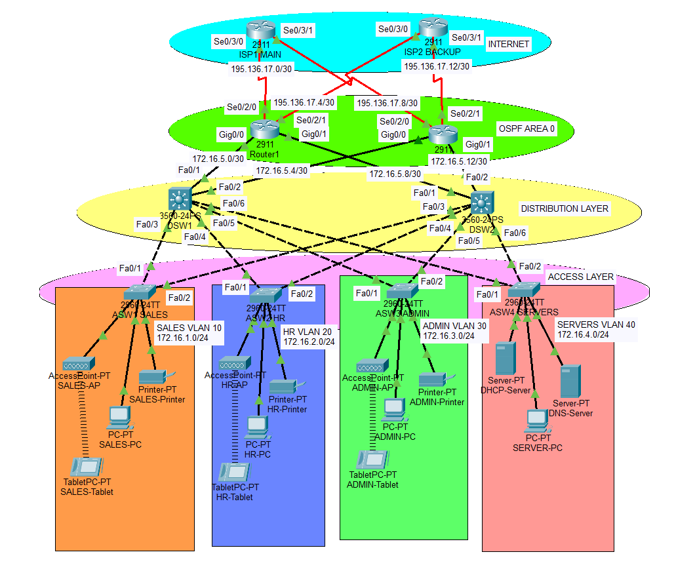

# 🌐 Enterprise Network Design with Dual ISP, OSPF, NAT & HSRP

## 📌 Overview
This project demonstrates the design and implementation of a scalable enterprise network with redundancy and dynamic routing. The network simulates a real-world architecture with dual ISPs, load balancing, and failover mechanisms.

---

## 🏗️ Network Architecture
- Multi-tier architecture (Access, Distribution, Edge)
- VLAN-based segmentation
- Dual ISP connectivity for redundancy

---

## ⚙️ Technologies Used
- VLANs & Trunking (802.1Q)
- Inter-VLAN Routing (Layer 3 Switch - SVI)
- OSPF (Dynamic Routing Protocol)
- HSRP (First Hop Redundancy Protocol)
- NAT/PAT (Internet access)
- DHCP (Centralized with relay)
- ACLs (Traffic control)
- SSH (Secure device access)
- Port Security

---

## 🌍 IP Addressing Scheme

| VLAN | Department | Network | Gateway (HSRP VIP) |
|------|-----------|--------|--------------------|
| 10   | Sales     | 172.16.1.0/24 | 172.16.1.1 |
| 20   | HR        | 172.16.2.0/24 | 172.16.2.1 |
| 30   | Admin     | 172.16.3.0/24 | 172.16.3.1 |
| 40   | Servers   | 172.16.4.0/24 | 172.16.4.1 |

---

## 🔁 Routing & Redundancy

- OSPF used for dynamic routing across routers and L3 switches
- Default route propagated using OSPF
- Dual ISP setup with primary and backup paths
- HSRP configured for gateway redundancy:
  - VLAN 10, 30 → Active on DSW1
  - VLAN 20, 40 → Active on DSW2

---

## 🌐 NAT Configuration

- PAT (NAT Overload) used for internet access
- Internal private IPs translated to public ISP IPs
- Separate NAT configuration on both edge routers

---

## 🔐 Security Features

- Port Security (MAC binding + violation shutdown)
- SSH for secure remote access

---

## 📡 DHCP Configuration

- Centralized DHCP server in VLAN 40
- `ip helper-address` used on SVIs to forward DHCP requests

---

## 🧪 Testing & Verification

- Verified connectivity using:
  - `ping`
  - `tracert`
  - `show ip route`
  - `show ip nat translations`
- Simulated failover scenarios:
  - Router failure
  - Link failure
- Confirmed uninterrupted connectivity during failover

---

## 📸 Topology

---

## 🚀 Key Learnings

- Real-world enterprise network design
- Integration of routing, NAT, and redundancy protocols
- Importance of path consistency (OSPF + HSRP + NAT alignment)
- Troubleshooting issues like:
  - NAT misconfiguration
  - Routing loops and TTL expiry

---

## 🔗 Author

**Aayush Doke**  
📍 Mumbai, India  
🔗 LinkedIn: https://www.linkedin.com/in/aayush-doke  
